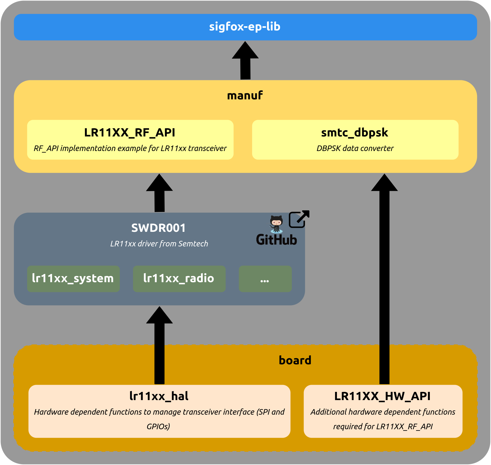

# LR11XX RF API implementation example

## Description

This **LR11XX RF API** is a low level implementation example of the [Sigfox EP library](https://github.com/sigfox-tech-radio/sigfox-ep-lib), showing the `manuf/rf_api.c` file implementation for the [LR1110](https://www.semtech.com/products/wireless-rf/lora-edge/lr1110) transceiver from Semtech.

The table below shows the version compatibility with the SIGFOX_EP_LIB version.

|                                   **LR11XX_RF_API**                                  |                              **SIGFOX_EP_LIB**                               |
|:----------------------------------------------------------------------------------:|:----------------------------------------------------------------------------:|
| [v1.0](https://github.com/sigfox-tech-radio/sigfox-ep-rf-api-semtech-lr11xx/releases/tag/v1.0) | [>= v3.2](https://github.com/sigfox-tech-radio/sigfox-ep-lib/releases/tag/v3.2) |

**Note:** the resulting radio performances of your device strongly depends on your hardware design (schematic, PCB routing, crystal oscillator placement, good RF practices, etc...). **Sigfox certification remains mandatory** whatever the software embedded in your device (including the Sigfox End-Point library and its implementation examples).

## Architecture

<p align="center">

</p>

## External LR11XX library

The **LR11XX RF API** is based on the official [LR11XX library](https://github.com/Lora-net/SWDR001) from Semtech. This library exposes a functional interface to configure the chip registers, which is used to perform the Sigfox uplink modulation and optional downlink reception.

## Hardware

The driver relies on **low level functions** (called board drivers) which need to be implemented to run on your specific hardware. There are divided in 2 groups:

* **lr11xx_hal** : low level functions of the LR11XX library from Semtech (registers access through SPI and shutdown pin management).
* **LR11XX_HW_API** : additional hardware-dependent functions required to get a generic RF API implementation of the LR11XX.

These drivers are located in the `src/board` folder.

## Code optimization

The driver inherits all the [Sigfox EP library](https://github.com/sigfox-tech-radio/sigfox-ep-lib) flags and can be optimized accordingly.

## Getting Started

### Cloning the repository

```bash
$ git clone https://github.com/sigfox-tech-radio/sigfox-ep-rf-api-semtech-lr11xx.git
```

### Usage

This code can be used in 3 different ways:
 * The [original source code](#original-source-code) to use the raw sources files
 * The [precompiled source code](#precompiled-source-code) to remove all unused source code and have more readability.
 * The [static-library](#static-library) to generate a compiled library.

### Original source code

Sources files are available in the `inc` and `src` folders and must be copied directly in your embedded project.

### Precompiled source code

#### Dependency

Before building process install **unifdef** and  **cmake**. The unifdef tool is used to remove dead code and cmake to build.

#### Building process

If you want to **precompile** the sources files for a given flags selection, you need to use the **cmake** commands:

Create a build folder:

```bash
$ cd sigfox-ep-rf-api-semtech-lr11xx
$ mkdir build
$ cd build
```

* Precompiling by reading the `inc/sigfox_ep_flags.h` file:

```bash
$ cmake -DSIGFOX_EP_LIB_DIR=<Sigfox EP library path> \
		-DUSE_SIGFOX_EP_FLAGS_H=ON ..
$ make precompil
```
* Precompiling by entering the flags selection on command line:

```bash
$ cmake -DSIGFOX_EP_LIB_DIR=<Sigfox EP library path> \
		-DUSE_SIGFOX_EP_FLAGS_H=OFF \
        -DRC1=ON \
        -DRC2=ON \
        -DRC3C=ON \
        -DRC3D=ON \
        -DRC4=ON \
        -DRC5=ON \
        -DRC6=ON \
        -DRC7=ON \
        -DAPPLICATION_MESSAGES=ON \
        -DCONTROL_KEEP_ALIVE_MESSAGE=ON \
        -DBIDIRECTIONAL=ON \
        -DASYNCHRONOUS=ON \
        -DLOW_LEVEL_OPEN_CLOSE=ON \
        -DREGULATORY=ON \
        -DLATENCY_COMPENSATION=ON \
        -DSINGLE_FRAME=ON \
        -DPARAMETERS_CHECK=ON \
        -DCERTIFICATION=ON \
        -DPUBLIC_KEY_CAPABLE=ON \
        -DVERBOSE=ON \
        -DCRC_HW=OFF \
        -DERROR_CODES=ON \
        -DUL_BIT_RATE_BPS=OFF \
        -DT_IFU_MS=OFF \
        -DT_CONF_MS=OFF \
        -DUL_PAYLOAD_SIZE=OFF \
        -DMESSAGE_COUNTER_ROLLOVER=OFF \
        -DERROR_STACK=12 ..
$ make precompil
```

The precompiled files will be generated in the `build/precompil` folder.

### Static library

If you want to build a **static library**, you need to run this additionnal **cmake** command:

```bash
$ make lr11xx_rf_api
```

The archive will be generated in the `build/lib` folder.
